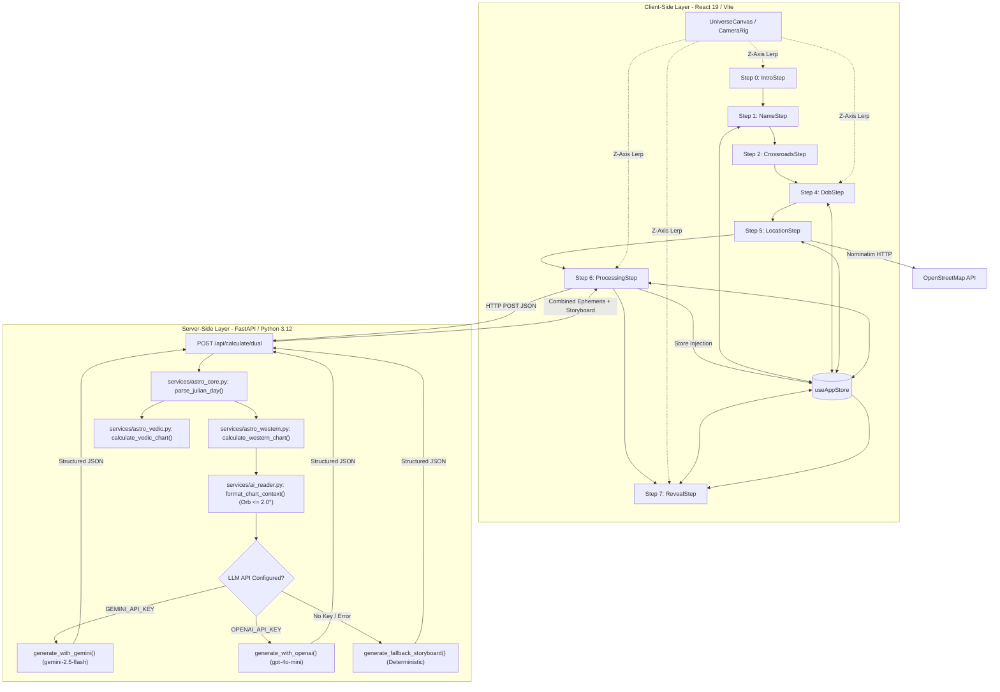
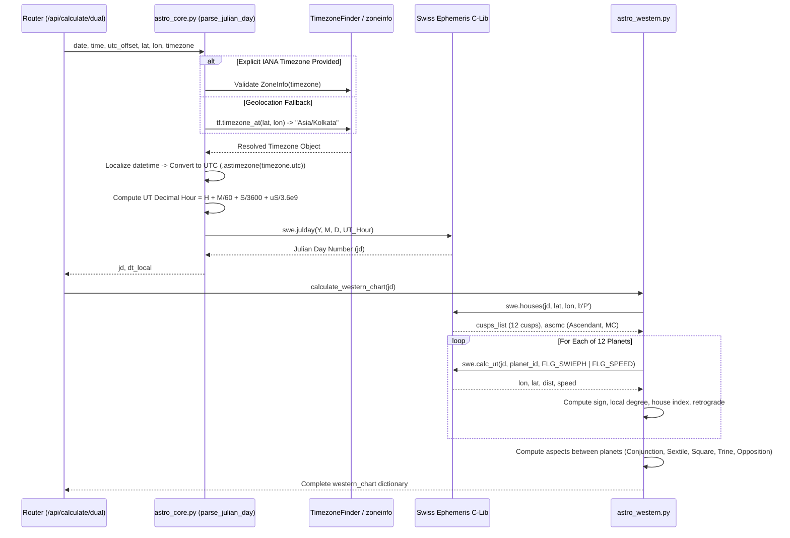

# Astrologica: Psychological Depth Pipeline — Current Architecture Blueprint

**Document Version:** 1.0.0  
**Audit Date:** September 2026  
**Target Subsystem:** "Psychological Depth" Journey (Western Ephemeris + AI Cosmic Reader + WebGL Cinematic Presenter)  
**File Location:** Root Directory (`CURRENT_ARCHITECTURE.md`)

---

## Executive Architectural Summary

Astrologica's "Psychological Depth" pipeline is a 3-tier hybrid computational system combining:
1. **Deterministic Celestial Mechanics:** High-precision astronomical ephemerides computed via the Swiss Ephemeris C-library wrapper (`pyswisseph`) with microsecond-accurate UT conversion.
2. **AI Synthesis (System 2):** Context-pruned, behavioral psychological chart interpretation executed via LLM structured outputs (Gemini 2.5 Flash / OpenAI GPT-4o-mini) and bounded by a deterministic 6-chapter algorithmic fallback.
3. **Cinematic WebGL Presentation:** A React Three Fiber / Three.js particle universe coupled with Framer Motion slide transitions and borderless typography.

This document serves as the **definitive reference blueprint** for the upcoming total re-architecture of this pipeline. It details every component, data contract, mathematical transformation, and structural vulnerability currently in production.

---

## High-Level System Architecture Diagram



---

## Phase 1: Frontend Architecture (React / Vite)

### 1.1 Component Tree & Navigation Lifecycle

The user journey is rendered inside `client/src/App.jsx` via `CinematicRoot()`, which wraps the WebGL background (`UniverseCanvas`) and orchestrates conditional step rendering through Framer Motion's `<AnimatePresence mode="wait">`.

| Step Index | Component | Primary Responsibility | Input Captured / Handled | Next Step |
|---|---|---|---|---|
| **0** | `IntroStep` | Splash landing screen | "Explore" CTA button | Step 1 |
| **1** | `NameStep` | User identity capture | Text input auto-capitalized to Title Case (`replace(/\b\w/g, char => char.toUpperCase())`). Enforces first & last name. | Step 2 |
| **2** | `CrossroadsStep` | Route selection | "Start cosmic journey", "About website", "Admin Console" (trap for 'admin') | Step 4 (or 3, 25) |
| **4** | `DobStep` | Birth timestamp capture | Mounts `CinematicChronologicalInputs.jsx` (6 custom scroll wheels: Day, Month, Year, Hour, Minute, AM/PM) | Step 5 |
| **5** | `LocationStep` | Birth location capture | Mounts `CinematicLocationSearch.jsx` (Country, State, City pickers + live search + geocoding) | Step 6 |
| **6** | `ProcessingStep` | API invocation & loader | Executes backend calculation via `calculateDual(payload)`, animates text phrases | Step 7 |
| **7** | `RevealStep` | Multi-slide cosmic journey | Mounts `CinematicReveal.jsx` (dynamic storyboard rendering + poster export) | Complete |

---

### 1.2 Data Collection, Validation, and Payload Assembly

#### Step 4: Chronological Input Assembly (`CinematicChronologicalInputs.jsx`)
- **State Properties:**
  - `day` (01–31)
  - `month` (01–12)
  - `year` (1920–2026)
  - `hour` (01–12)
  - `minute` (00–59)
  - `ampm` ('AM' | 'PM')
- **Transformation:**
  When all 6 states are truthy, converts 12-hour AM/PM to 24-hour military time:
  ```javascript
  let h24 = parseInt(hour, 10);
  if (ampm === 'PM' && h24 < 12) h24 += 12;
  if (ampm === 'AM' && h24 === 12) h24 = 0;
  const formattedTime = `${String(h24).padStart(2, '0')}:${minute}`;
  const formattedDate = `${year}-${month}-${day}`;
  ```
- **Validation:** Only checks that all fields are non-empty (`isAllSelected`). **No calendar day-of-month validation is performed** (e.g., February 31 is permitted to pass).

#### Step 5: Location Geocoding & Timezone Resolution (`CinematicLocationSearch.jsx`)
- **Data Source:** `country-state-city` npm package.
- **Filter Interface:** Minimalist text input (`searchQuery`) filtering data arrays via `.filter(option => option.name?.toLowerCase().includes(q))`.
- **Geocoding Flow:**
  1. Concatenates `[cityName, stateName, countryName].filter(Boolean).join(', ')`.
  2. Queries OpenStreetMap Nominatim:
     `https://nominatim.openstreetmap.org/search?format=json&q=${encodeURIComponent(locationName)}&limit=1`
  3. Extracts `lat = parseFloat(data[0].lat)` and `lon = parseFloat(data[0].lon)`.
  4. Extracts timezone from `selectedCountryObj?.timezones?.[0]` (`zoneName` and `gmtOffsetName`).
- **Payload Dispatched to Store (`setBirthData`):**
  ```javascript
  {
    lat: 22.7196,
    lng: 75.8577,
    locationName: "Indore, Madhya Pradesh, India",
    utcOffset: "+05:30",
    timezone: "Asia/Kolkata",
    country: "India",
    state: "Madhya Pradesh",
    city: "Indore"
  }
  ```

#### Step 6: Backend Payload Assembly (`App.jsx: ProcessingStep`)
`ProcessingStep` triggers a single execution on mount using `called = React.useRef(false)`:
```javascript
const payload = {
  date:         birthData?.date || '2000-01-01',
  time:         birthData?.time || '12:00',
  utc_offset:   birthData?.utcOffset || '+00:00',
  timezone:     birthData?.timezone || null,
  lat:          parseFloat(birthData?.lat ?? 0.0),
  lon:          parseFloat(birthData?.lng ?? 0.0),
  ayanamsha:    'lahiri',
  house_system: 'placidus',
};
const result = await calculateDual(payload);
setAstrologyData(result);
setRevealSlide(0);
advanceStep(7, `${userName} received ephemeris storyboard`);
```

---

### 1.3 WebGL Engine & UI Presentation (`CinematicReveal.jsx` & `UniverseCanvas.jsx`)

#### 1. WebGL Canvas Architecture (`UniverseCanvas.jsx`)
- **Renderer:** `@react-three/fiber` Canvas (`gl={{ antialias: false, alpha: false }}`, `dpr={[1, 1.5]}`).
- **Scene Contents:**
  - `StarField`: BufferGeometry with 22,000 randomized particles (`COUNT = 22000`), custom circular radial gradient alpha map (`createCircleTexture()`), continuous rotation on X and Y axes via `useFrame`.
  - `NebulaDust`: Toroidal particle distribution of 4,000 indigo/blue points (`#4466ff`, `COUNT = 4000`) rotating on the Z-axis.
- **CameraRig:**
  - Reads `cinematicStep` and `revealSlide` from `useAppStore`.
  - Computes target camera position:
    ```javascript
    const STEP_Z = [120, 95, 68, 48, 58, 42, 30, 22];
    const REVEAL_Z = [22, 18, 15, 12, 8];
    ```
  - Smoothly lerps `camera.position.z` toward target:
    `state.camera.position.z += (targetZ - state.camera.position.z) * 0.028`

#### 2. Cinematic Presentation Architecture (`CinematicReveal.jsx`)
- **Storyboard Consumption:**
  Extracts `chapters = astrologyData?.storyboard || []`.
  Provides defensive single-chapter fallback if storyboard is empty.
- **Slide Navigation:**
  Driven by `revealSlide` state in Zustand.
  Current slide: `currentChapter = chapters[Math.min(revealSlide, chapters.length - 1)]`.
  Total chapters dynamically determined from backend response (typically 6–8 chapters).
- **Typography & Layout Constraints:**
  - Borderless, dark aesthetic (zero cards or rectangular bounding boxes).
  - Invisible scrolling container:
    ```jsx
    <div className="overflow-y-auto scrollbar-none [&::-webkit-scrollbar]:hidden [-ms-overflow-style:none] [scrollbar-width:none] max-h-[60vh] pb-12 gap-3 flex flex-col w-full px-4">
    ```
  - Text wrapping: Enforced `break-words` and `leading-relaxed` on `h3`, `p`, and disclaimer to prevent horizontal overflow.
- **Dynamic Vector Icon Resolvers:**
  - Inspects `currentChapter.sections[0].icon_hint`.
  - Resolves elemental color and drop-shadow (`getIconGlowClass`).
  - Renders custom vector SVG:
    - 12 Zodiac signs from `ZODIAC_SVG_COMPONENTS` (`bigThreeData.jsx`).
    - Dedicated planetary SVGs: Sun, Moon, Mercury, Venus, Mars, Jupiter, Saturn, Uranus, Neptune, Pluto.
    - Aspect geometry SVGs: Square, Trine, Stellium/Conjunction.
- **High-Res Poster Generation:**
  - Renders hidden off-screen DOM node (`exportRef`) styled at 800px × 1200px.
  - On "Download Blueprint Poster", invokes `html2canvas(exportRef.current, { scale: 2, useCORS: true })`.
  - Generates PNG download via dynamic `<a>` tag.

---

## Phase 2: Backend Architecture (Python / FastAPI)

### 2.1 API Endpoints and Pydantic Contracts

The backend server is hosted in `server/main.py`.

#### Endpoint 1: Dual Calculation & AI Storyboard Synthesis
- **Route:** `POST /api/calculate/dual`
- **Request Model:** `DualRequest` (`server/models.py`)
  ```python
  class DualRequest(BaseBirthDataRequest):
      date: str         # "YYYY/MM/DD" or "YYYY-MM-DD"
      time: str         # "HH:MM"
      utc_offset: str   # "+05:30"
      timezone: Optional[str] = None # "Asia/Kolkata"
      lat: float        # Validated: -90.0 <= lat <= 90.0
      lon: float        # Validated: -180.0 <= lon <= 180.0
      ayanamsha: str    # "lahiri", "raman", "kp"
      house_system: str # "placidus", "whole_sign"
  ```
- **Execution:**
  1. Computes Western chart (`calculate_western_chart`).
  2. Computes Vedic chart (`calculate_vedic_chart`).
  3. Synthesizes comparative precession differences.
  4. Calls `synthesize_chart_storyboard(western_chart)` to invoke the LLM.
  5. Injects `storyboard` and `disclaimer` into the response payload.
- **Response Schema:** JSON object containing `western`, `vedic`, `comparison`, `meta`, `storyboard` (list), and `disclaimer` (str).

#### Endpoint 2: AI Cosmic Reader Standalone Synthesis
- **Routes:** `POST /api/interpret-chart` and `POST /api/calculate-chart`
- **Response Model:** `StoryboardResponse` (`server/services/ai_reader.py`)
  ```python
  class StoryboardSection(BaseModel):
      heading: str
      body: str       # Maximum 60 words, concrete behavioral reading
      icon_hint: str  # Lowercase identifier (e.g. "mercury", "gemini", "aspect_square")

  class StoryboardChapter(BaseModel):
      chapter_title: str
      sections: List[StoryboardSection]

  class StoryboardResponse(BaseModel):
      storyboard: List[StoryboardChapter]
      disclaimer: str
  ```

---

### 2.2 Astronomical Ephemeris Calculation Pipeline

The calculation pipeline resides across `server/services/astro_core.py` and `server/services/astro_western.py`.



#### Timezone & Julian Day Computation Mechanics
1. **IANA Geographical Resolution:** Uses `TimezoneFinder().timezone_at(lat, lon)` when no explicit string is passed.
2. **UTC Conversion:** Avoids dropping fractional minutes. For IST (+05:30), `dt_utc` accounts for the 30-minute shift accurately.
3. **UT Decimal Hour:** Calculated down to microseconds:
   `ut_decimal_hour = dt_utc.hour + (dt_utc.minute / 60.0) + (dt_utc.second / 3600.0) + (dt_utc.microsecond / 3600000000.0)`
4. **House Cusps:** Passed to `swe.houses(jd, lat, lon, hsys_code)` where `hsys_code = b'P'` (Placidus) or `b'W'` (Whole Sign).

---

### 2.3 Strict Aspect Pruning & Prompt Payload Conditioning

Before raw ephemeris data reaches the LLM, `server/services/ai_reader.py: format_chart_context()` sanitizes the input:

```python
tight_aspects = [
    asp for asp in aspects 
    if float(asp.get("orb", 999.0)) <= 2.0
]
tight_aspects.sort(key=lambda a: float(a.get("orb", 999.0)))
```
- **Aspect Stripping:** All aspects with `orb > 2.0°` are **completely stripped** from the context prompt.
- **Negative Prompting:** If no aspects have `orb <= 2.0°`, the prompt explicitly injects:
  `- None (no aspects with orb <= 2.0° detected in this chart)`.
- **Reasoning:** Prevents LLM hallucinations where wide, weak aspects (e.g. Sun Trine Mars with a 7.67° orb) were erroneously described as "acute" or "tight crucibles."

---

### 2.4 Prompt Engineering & Grounded Behavioral Ruleset

The system prompt injected into both Gemini and OpenAI chains enforces a clinical, behavioral psychologist persona:

```text
You are a master psychological astrologer. Your goal is to synthesize the provided chart into concrete, behavioral reality. 

STRICT RULES FOR WRITING:
1. NO ASTROLOGY WORD SALAD: Never use decorative, abstract phrases like 'conscious solar core,' 'navigational mask,' 'karmic responsibility,' or 'vibrational frequency.' Speak normally.
2. BE CONCRETE: Describe specific scenarios the reader can test against their own week. Instead of writing 'You communicate with poise,' write 'People probably clock you as a talker before they learn anything else.'
3. ACCURACY OVER VIBES: Never hallucinate traits. Taurus is steady, sensory, and resists being rushed; it is NEVER about 'unexplored frontiers.' 
4. SYNTHESIS IS REQUIRED: Do not read a planet and a house separately. If the Sun is in Gemini (curious, scattered) but sitting in the 2nd House (resources, stability), you must explain how the house grounds the sign (e.g., 'Your need to explain things is in service of building a specific skill that is genuinely yours. You want to own what you know.'). 
5. TONE: Keep the tone sharp, direct, empathetic, and highly specific. Write as if you are talking to a smart friend across a table.
```

#### Structured Output Enforcement
- **Google Gemini:**
  - Client: `google.genai.Client(api_key=api_key)`
  - Model: `gemini-2.5-flash`
  - Mode: `response_mime_type="application/json"` with `response_json_schema=StoryboardResponse.model_json_schema()`.
- **OpenAI:**
  - Endpoint: `https://api.openai.com/v1/chat/completions`
  - Model: `gpt-4o-mini`
  - Mode: `response_format={"type": "json_object"}`.

---

### 2.5 Deterministic Fallback Synthesis (`generate_fallback_storyboard`)

If API keys are missing, network connectivity fails, or the LLM output violates schema validation, the pipeline falls back to `generate_fallback_storyboard()`.

This engine deterministically constructs 6 chapters compliant with `StoryboardResponse`:
1. **Chapter 1: The Big Three:** Sun (Sign + House), Moon (Sign + House), Ascendant.
2. **Chapter 2: Chart Ruler & Core Geometry:** Mercury (Sign + House), Mars (Sign + House).
3. **Chapter 3: Relational Chemistry & Values:** Venus (Sign + House), Jupiter (Sign + House).
4. **Chapter 4: Aspectual Tensions & Clusters (Strict Orb $\le$ 2.0°):**
   - If $\ge 2$ tight aspects: Renders exact pairs with formatted degrees.
   - If $1$ tight aspect: Renders primary tension + "Singular Harmonic Crucible".
   - If $0$ tight aspects: Renders "Unhindered Planetary Matrix" + "Harmonic Diffusion".
5. **Chapter 5: Career Signature & Calling:** Midheaven (MC sign/degree), Saturn (Sign + House).
6. **Chapter 6: Transpersonal Evolution & Depths:** Uranus (Sign + House), Pluto (Sign + House).

*All fallback section bodies are strictly under 60 words and completely free of word-salad expressions.*

---

## Phase 3: Bottleneck & Fracture Identification

The audit identified **8 critical structural vulnerabilities and architectural fractures** in the current implementation:

### Fracture 1: Event-Loop Thread Blocking in FastAPI Endpoints
- **Location:** `server/services/ai_reader.py` (`generate_with_gemini`, `generate_with_openai`) called inside `server/main.py`.
- **Problem:** `generate_with_gemini` uses the synchronous `client.models.generate_content(...)` call, and `generate_with_openai` uses synchronous `httpx.post(...)`. Both are executed directly inside `async def calculate_dual_endpoint(...)`.
- **Impact:** In Python's `asyncio`, running synchronous network I/O inside a coroutine **blocks the entire server event loop thread**. If 5 users simultaneously request charts, the server cannot process any other incoming requests until the external LLM API responds.
- **Remedy Required:** Use `httpx.AsyncClient` or run synchronous calls inside `asyncio.to_thread()`, or migrate to an asynchronous worker queue.

---

### Fracture 2: Monolithic Endpoint Coupling (Ephemeris + Vedic + AI)
- **Location:** `server/main.py: calculate_dual_endpoint` invoked by `client/src/App.jsx: ProcessingStep`.
- **Problem:** When the user enters their birth details for "Psychological Depth", `ProcessingStep` calls `/api/calculate/dual`. This endpoint:
  1. Computes Western chart ($\approx 1.5\text{ms}$).
  2. Computes Vedic chart ($\approx 2.0\text{ms}$) — **completely unused by the Psychological Depth reveal**.
  3. Computes dual comparative precession shifts ($\approx 0.5\text{ms}$) — **completely unused**.
  4. Waits for the external LLM to generate 6–8 chapters ($\approx 2,000\text{ms} - 7,000\text{ms}$).
- **Impact:** High latency. The user is locked in the warp tunnel waiting for Vedic calculations they did not ask for, followed by a monolithic LLM call. If the LLM call times out after 30 seconds, the ephemeris calculation is also dropped.
- **Remedy Required:** Decouple into two endpoints:
  - Immediate `POST /api/calculate/western` (returns within 10ms for instant client-side rendering).
  - Progressive / streaming `POST /api/interpret-chart` (streams chapters as they are generated).

---

### Fracture 3: Timezone Inaccuracy from Country-Level Truncation
- **Location:** `client/src/components/cinematic/CinematicLocationSearch.jsx: handleContinue`.
- **Problem:**
  ```javascript
  const tzObj = selectedCountryObj?.timezones?.[0];
  const timezoneName = tzObj?.zoneName || null;
  const preciseOffset = tzObj?.gmtOffsetName ? ...
  ```
  `selectedCountryObj.timezones[0]` takes the **first timezone of the entire country**. For the United States, this is always `America/New_York` (UTC-05:00).
- **Impact:** If a user selects "Los Angeles, California, United States", the frontend sends `timezone: "America/New_York"` and `utcOffset: "-05:00"`. Because the backend prioritizes explicit `tz_str` over coordinate inference, the chart is calculated with a **3-hour error**, causing the Ascendant and houses to drift by $\approx 45^\circ$!
- **Remedy Required:** Eliminate client-side timezone guesswork; rely strictly on backend `TimezoneFinder` resolving from exact geocoded coordinates (`lat, lon`).

---

### Fracture 4: Calendar Day-of-Month Validation Gap
- **Location:** `client/src/components/cinematic/CinematicChronologicalInputs.jsx`.
- **Problem:** The wheel picker provides days 1 to 31 statically for all months.
- **Impact:** A user can select "February 31" or "April 31". When submitted, Python's `datetime(year, month, day, ...)` throws a `ValueError: day is out of range for month`, causing the backend to return `HTTP 422 Unprocessable Entity` and triggering an unhandled calibration failure in `ProcessingStep`.
- **Remedy Required:** Dynamically compute available days based on the selected month and leap year (`new Date(year, month, 0).getDate()`).

---

### Fracture 5: Client-Side Geocoding Fragility & CORS/Rate-Limit Exposure
- **Location:** `client/src/components/cinematic/CinematicLocationSearch.jsx: handleContinue`.
- **Problem:** Direct `fetch()` calls to `https://nominatim.openstreetmap.org/search` from the client browser.
- **Impact:**
  - Nominatim enforces a strict policy of 1 request/sec and blocks browsers without descriptive User-Agents.
  - Browser ad-blockers or privacy extensions frequently block Nominatim requests.
  - When Nominatim fails, the catch block sets `lat: 0.0, lng: 0.0` (Gulf of Guinea / "Null Island"), computing a totally incorrect chart without alerting the user.
- **Remedy Required:** Route all geocoding requests through a backend caching proxy (`/api/geocode/search`) with built-in retries and fallback databases.

---

### Fracture 6: WebGL Camera Rig Truncation (`REVEAL_Z` vs Dynamic Chapters)
- **Location:** `client/src/components/canvas/UniverseCanvas.jsx`.
- **Problem:**
  ```javascript
  const REVEAL_Z = [22, 18, 15, 12, 8];
  function getCameraTarget(step, revealSlide) {
    if (step === 7) return REVEAL_Z[Math.min(revealSlide, REVEAL_Z.length - 1)];
  }
  ```
- **Impact:** `REVEAL_Z` has only 5 hardcoded camera positions. However, the AI reader dynamically produces 6 to 8 chapters. Once the user reaches Chapter 5, the camera stops moving entirely for Chapters 6, 7, and 8, breaking the cinematic immersion.
- **Remedy Required:** Dynamically calculate camera Z based on normalized slide progress: `targetZ = 22 - (revealSlide / (totalChapters - 1)) * 14`.

---

### Fracture 7: Off-Screen DOM Rendering & `html2canvas` Mobile Vulnerability
- **Location:** `client/src/components/cinematic/CinematicReveal.jsx: handleDownload`.
- **Problem:** The poster template is a hidden `<div>` positioned off-screen at `top: -9999px, left: -9999px`.
- **Impact:** On mobile browsers (iOS Safari, Android Chrome), rendering an element far outside the viewport via `html2canvas` often leads to blank images, texture memory crashes, or black boxes due to GPU texture size limits and viewport virtualization.
- **Remedy Required:** Use a direct `<canvas>` drawing pipeline or SVG-to-Canvas rasterizer that does not depend on off-screen DOM layout.

---

### Fracture 8: Missing Angle / Cusp Aspects in Aspect Matrix
- **Location:** `server/services/astro_western.py: calculate_western_chart`.
- **Problem:**
  ```python
  p_keys = [p for p in planets if p["id"] not in ["rahu", "ketu"]]
  for i in range(len(p_keys)):
      for j in range(i + 1, len(p_keys)):
          ...
  ```
- **Impact:** The aspect loop only iterates across planetary bodies. It **completely ignores aspects to the Ascendant (AC) and Midheaven (MC)**. In psychological astrology, a planet tightly conjunct or square the Ascendant (e.g. Pluto conjunct Ascendant at $0.4^\circ$) is the dominant behavioral signature of the personality. Currently, these aspects never enter the aspect list and are invisible to the AI Cosmic Reader.
- **Remedy Required:** Expand aspect calculations to include angles (`Ascendant`, `Midheaven`).

---

## State Data Flow Matrix

| State Property | Store / Scope | Originating Component | Consuming Components |
|---|---|---|---|
| `userName` | `useAppStore` | `NameStep.jsx` | `CrossroadsStep`, `CinematicReveal` (Header & Poster) |
| `birthData.date` | `useAppStore` | `DobStep.jsx` -> `CinematicChronologicalInputs` | `ProcessingStep`, `CinematicReveal` (Poster) |
| `birthData.time` | `useAppStore` | `DobStep.jsx` -> `CinematicChronologicalInputs` | `ProcessingStep`, `CinematicReveal` (Poster) |
| `birthData.lat/lng` | `useAppStore` | `LocationStep.jsx` -> `CinematicLocationSearch` | `ProcessingStep` |
| `birthData.locationName` | `useAppStore` | `LocationStep.jsx` -> `CinematicLocationSearch` | `CinematicReveal` (Poster) |
| `astrologyData` | `useAppStore` | `ProcessingStep.jsx` (`calculateDual` result) | `CinematicReveal.jsx` (`storyboard`, `western`) |
| `cinematicStep` | `useAppStore` | `App.jsx` step navigators (`advanceStep`) | `CinematicRoot`, `UniverseCanvas` (`CameraRig`) |
| `revealSlide` | `useAppStore` | `CinematicReveal.jsx` ("Next", "Back") | `CinematicReveal`, `UniverseCanvas` (`CameraRig`) |

---

## Architectural Recommendations for the Upcoming Re-Architecture

1. **Adopt a Progressive Pipeline (Split Math from LLM):**
   - Call 1: Immediate ephemeris calculation ($< 15\text{ms}$). Render the chart geometry, Big Three, and planetary placements instantly.
   - Call 2: Background AI Cosmic synthesis. Stream synthesized chapters into the UI via Server-Sent Events (SSE) or WebSockets so the user never waits in a blank loader.
2. **True Asynchronous Backend:**
   - Migrate Gemini and OpenAI calls to native async clients (`AsyncClient` / async SDK) and offload CPU-bound ephemeris tasks to a process pool or async thread.
3. **Backend-Controlled Geolocation & Timezones:**
   - Never trust client-selected timezone strings from broad country mappings.
   - Forward `lat` and `lon` to the backend and let `TimezoneFinder` deterministically set the IANA timezone.
4. **Include Angular Aspects:**
   - Add planet-to-Ascendant and planet-to-Midheaven aspects to the ephemeris calculation pipeline before pruning orbs.
5. **Robust Calendar Constraints:**
   - Enforce day-month-year relational validity on the client wheel pickers to make invalid calendar submissions mathematically impossible.

---
*End of Architectural Audit Document — Prepared for Systems Re-Architecture.*
