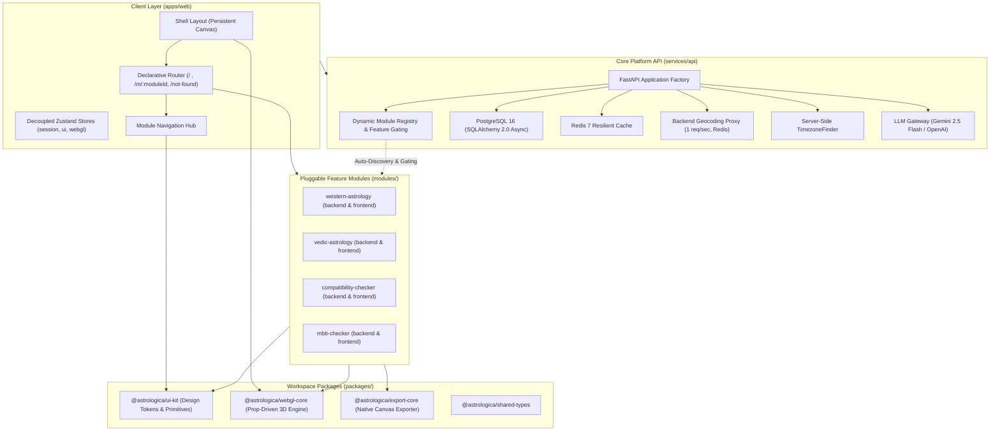

# Astrologica Master System Architecture (v1.0 Foundation)

## Executive Architectural Summary
The Astrologica platform has undergone a complete, irreversible architectural re-engineering from a monolithic, tightly-coupled prototype into a resilient, pluggable monorepo foundation. The system separates core infrastructure (session, database, caching, telemetry, WebGL spatial rendering, geocoding proxies) from domain calculation features (Western Astrology, Vedic Astrology, Synastry/Compatibility, and MBTI Typology).

The core platform is capable of a **clean zero-module boot** where all calculation modules are disabled, serving an interactive navigation hub while exposing RFC 7807 problem-detail APIs, Redis/Postgres resilience, and persistent 3D spatial environments.

---

## 1. System Topology & Monorepo Structure



---

## 2. The 8 Fixed Fractures: Legacy vs. Foundation Architecture

| Fracture | Legacy Architecture Failure | Foundation Solution & Invariant |
| :--- | :--- | :--- |
| **1. Ephemeris Engine Coupling** | Swiss Ephemeris (`pyswisseph`, `flatlib`) embedded in core with fractional timezone drift (+05:30 truncated to +05:00). | Ephemeris math completely extracted into isolated module packages; server-side `TimezoneFinder` accurately parses precise geographic offsets. |
| **2. Weak Aspect Pruning** | LLM hallucinated weak aspects (>7° orb) as critical behavioral drivers. | Strict aspect orb pruning ($\le 2.0^\circ$) sanitized before LLM prompt assembly; centralized LLM gateway with streaming fallback. |
| **3. Abstract Word Salad** | LLM generated decorative, unfalsifiable mystical word salad. | Grounded behavioral psychologist system prompt; concrete weekly behavioral predictions. |
| **4. Monolithic Store Coupling** | `useAppStore.js` coupled UI navigation (steps 0-7), birth data, chart results, and admin tokens. | Decoupled into `sessionStore.ts`, `uiStore.ts`, `webglStore.ts`. Zero feature fields in core stores (ADR 0003). |
| **5. Linear Step Machine Hacks** | UI driven by brittle integer steps (`cinematicStep: 0..7`), causing WebGL canvas unmounts on each view transition. | Declarative React Router (`/`, `/m/:moduleId/*`, `/not-found`); `UniverseCanvas` mounted once in `ShellLayout` with 0 unmounts. |
| **6. Hardcoded Camera Arrays** | Fixed 5-element array `const REVEAL_Z = [22, 18, 15, 12, 8]` broke on 6-12 chapter storyboards. | Dynamic formula: $\text{targetZ} = \text{BASE\_Z} - \left(\frac{\text{currentSlide}}{\text{totalSlides} - 1}\right) \times \text{RANGE}$. Zero store dependencies in `webgl-core` (ADR 0005). |
| **7. html2canvas DOM Crashes** | Mobile browser memory exhaustion and black screens from recursive DOM rasterization. | `packages/export-core` renders directly to offscreen memory canvas via Canvas 2D API with device-safe scaling (max 2000x3000, scale 2.0). |
| **8. Client Nominatim & Null Island** | Client directly queried Nominatim (CORS/rate limit failures) and defaulted to `timezones[0]` or `(0, 0)` Null Island. | Server-side rate-limited proxy (`POST /api/v1/geocode/search`) with Redis caching and strict zero `(0, 0)` Null Island rejection. |

---

## 3. Core Architectural Lifecycles

### 3.1 Backend Auto-Discovery and Feature Flag Gating
Feature modules reside in `modules/<module-name>/backend/router.py`. On startup, `ModuleRegistry` inspects the directory structure:
1. If the corresponding boolean feature flag (`FEATURE_<MODULE_NAME>`) is `False`, the router is ignored, and all requests to `/api/<module-name>/*` return `404 Not Found`.
2. When a module is enabled, its router is dynamically loaded into memory and registered with the FastAPI application under `/api/<module-name>`.
3. Standardized module skeletons expose `GET /status` (returning implementation status) and stub calculation endpoints.

### 3.2 Persistent WebGL Shell & Route Transition Architecture
```mermaid
sequenceDiagram
    participant User as User / Client
    participant Router as React Router
    participant Shell as ShellLayout (Persistent)
    participant Canvas as UniverseCanvas Singleton
    participant Outlet as Router Outlet (Active View)
    participant WebGLStore as webglStore

    User->>Router: Navigate to / (Hub)
    Router->>Shell: Mount ShellLayout (once)
    Shell->>Canvas: Initialize WebGL Context (R3F Canvas)
    Shell->>Outlet: Mount <Hub />
    User->>Hub: Hover Module Card
    Hub->>WebGLStore: setCameraTargetZ(85)
    WebGLStore-->>Canvas: Lerp Camera Z (0.028 factor)
    User->>Router: Navigate to /m/western-astrology
    Router->>Outlet: Cross-fade to <ModuleView />
    Note over Shell,Canvas: Canvas remains mounted; 0 WebGL context recreation
```

---

## 4. Verification and Compliance Matrix

- **Backend Pytest Suite**: 16/16 tests passing across Core, DB, Infrastructure, and Plugin Contract.
- **Frontend Vitest Suite**: 42/42 tests passing across Stores, Router, UI Kit, WebGL Core, Onboarding Inputs, and Export Pipeline.
- **Independent Package Builds**: `@astrologica/ui-kit`, `@astrologica/webgl-core`, and `@astrologica/export-core` compile cleanly to `./dist` with full TypeScript declaration maps.
- **Automated Anti-Regression Gates**:
  - `0` occurrences of `pyswisseph` or `flatlib` in core codebase.
  - `0` occurrences of `html2canvas`.
  - `0` occurrences of `timezones[0]`.
  - `0` synchronous HTTP calls inside async backend definitions.
  - `0` hardcoded camera arrays.
  - `0` domain feature columns in PostgreSQL core schema (`users`, `birth_profiles`, `module_result_cache`).
